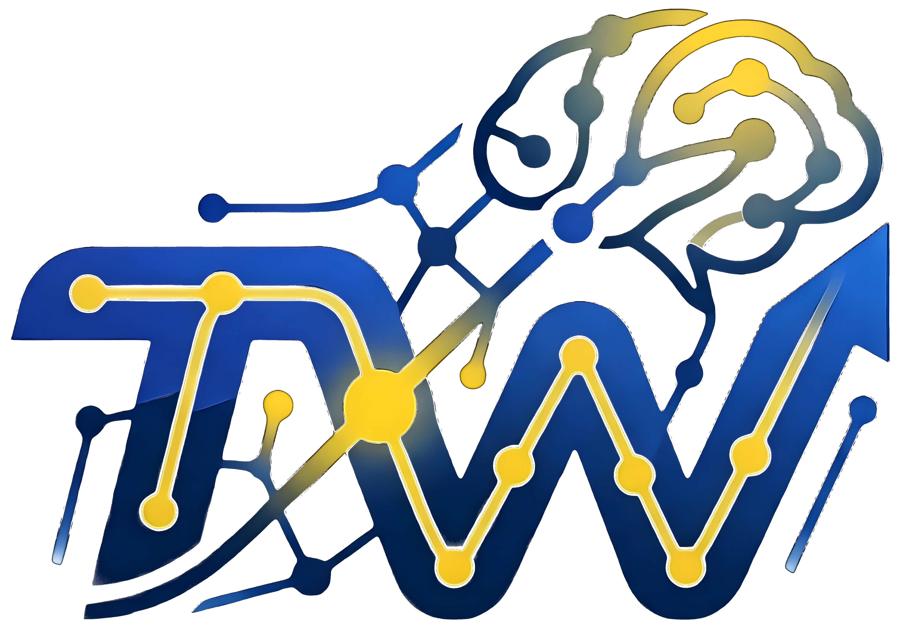

# Projeto - Tech Week

  
  <h1 align="center">Tech Week</h1>

 

    
    
    
    
    

## 📌 Índice
1. [Descrição](#-descrição)
2. [Funcionalidades](#-funcionalidades)
3. [Tecnologias Utilizadas](#️-tecnologias-utilizadas)
4. [Demonstração da Página](#-demonstração-da-página)
5. [Deploy](#-deploy)
6. [Como executar o projeto](#-como-executar-o-projeto)
7. [Sobre os Autores](#-sobre-a-autora)

## 📋 Descrição

    &emsp;&emsp; A <strong>Tech Week</strong> é a semana de tecnologia da Unicesumar Londrina, um evento interno criado para reunir estudantes, professores e profissionais da área. A edição desse ano conta com o tema 'Inteligência Artificial em Ação: Dados, Inovação e Transformação Digital'.  
    &emsp;&emsp; O projeto Tech Week, consiste em uma plataforma web que será responsável por exibir todo o cronograma do evento, desenvolvido por uma equipe de alunos, que tiveram como desafio atuar como uma agência de software. Todos contribuíram para o desenvolvimento, mas cada membro contava com uma responsabilidade específica — detalhada na seção de autores.  
    &emsp;&emsp; A plataforma será o ponto de informações de todo o evento. Por meio dela os estudantes podem se cadastrar, podem solicitar apresentar um projeto próprio, e os profissionais que tem interesse em compartilhar seu conhecimento, podem enviar uma proposta de palestra.  
    &emsp;&emsp; O projeto foi construída buscando uma plataforma responsiva, visando grande acesso por dispositivos móveis, com foco também em acessibilidade e experiência do usuário.

## ✨ Funcionalidades

🖥️ Interface & Experiência

- 🎨 **Grid - Canvas** → Fundo animado e interativo com partículas que reagem ao movimento do mouse.
- 🌙 **Botão Tema** → Permite alternar entre tema claro e escuro para maior conforto visual.
- 💾 **Persistência de Tema** → A preferência de tema é salva via localStorage, mantendo a escolha mesmo após fechar e reabrir a página.
- 🃏 **Cards Interativos** → Os cards de cada dia são exibidos recolhidos por padrão e expandem ao passar o mouse, revelando as sessões com horário e local.
- 🧭 **Navegação entre páginas** → Header com navegação entre Home, Participante e Palestrante, presente em todas as páginas do portal.

🤖 Suporte & Informação

- ❓ **FAQ** → Perguntas frequentes fixas para maior rapidez em encontrar respostas.
- 💬 **ChatBot** → Feito puramente com JS, responde perguntas relacionadas ao evento e encaminha o usuário diretamente a seções específicas da página.

📋 Formulários & Inscrições

- 📝 **Formulário de Inscrição de Participantes** → Cadastro com validação de campos obrigatórios (nome, RA, curso e semestre), com exibição de erros de forma dinâmica.
- 🗂️ **Inscrição para Apresentação de Projetos** → O participante pode marcar que deseja apresentar um projeto, revelando campos adicionais dinamicamente.
- 🎤 **Formulário de Inscrição de Palestrantes** → Envio de proposta de palestra com validação de dados pessoais, tema, briefing e mini currículo.

🔐 Administração

- 👤 **Perfil Administrador** → Permite ao responsável acompanhar as inscrições e selecionar as palestras que irão aparecer na página principal.

---

## 🛠️ Tecnologias Utilizadas

| Tecnologia | Uso |
|---|---|
| **HTML5** | Estrutura de todas as páginas do portal, incluindo os formulários de inscrição de participantes e palestrantes. |
| **CSS3** | Estilização personalizada da interface, incluindo o tema claro/escuro, responsividade e os cards interativos. |
| **JavaScript** | Lógica do chatbot, validação dos formulários, animação do canvas interativo, persistência do tema via localStorage e comportamentos dinâmicos da página. |
| **Spring Boot** | Back-end da aplicação, responsável pelo gerenciamento das inscrições e pelo painel do administrador. |
| **MySQL** | Banco de dados relacional utilizado para armazenar as inscrições de participantes, propostas de palestrantes e dados do painel administrativo. |
| **Canvas API** | Renderização do fundo animado de partículas interativas na página principal. |

## 📸 Demonstração da Página

      

## 🔗 Deploy

    

## 🚀 Como executar o projeto

⚠️ Necessário ter o Git já devidamente instalado, e configurado em seu computador. ⚠️  

Utilizando o git clone, clone o repositório para seu dispositivo local e abra o arquivo **index.html**  

1. Acesse uma pasta do seu computador, através do terminal (VSCode, CMD).  
*Nessa pasta que o git irá armazenar os arquivos, vindo do repositório.*
2. Utilize: `cd` + (endereço da pasta). Exemplo: cd C:\Users\usuário\documentos\projetos  
3. Estando dentro da pasta através do terminal, use o comando: `git clone https://github.com/WesleyLuciano04/PROJETO-WEEKTECH.git`
4. Localize a pasta onde os arquivos foram clonados.  
*O git clone baixa o repositório em seu computador, como uma pasta.*  
5. Abra a pasta clonada.  
6. Abra o arquivo *`index.html`* no navegador.  

## 👨‍💻 Sobre os Autores

A equipe é composta por estudantes de Engenharia de Software e Análise e Desenvolvimento de Sistemas da Unicesumar Londrina.

 

<table>
  <tr>
    <td align="center">
      <a href="https://github.com/Kafnosof">
         
        <b>Cristian Ferreira</b>
      </a> 
      Desenvolvedor Back-end
    </td>
    <td align="center">
      <a href="https://github.com/DaviAlme1da">
         
        <b>Davi Almeida</b>
      </a> 
      Designer UI/UX · Back-end
    </td>
    <td align="center">
      <a href="https://github.com/EmmanuelLucasRM">
         
        <b>Emannuel Lucas</b>
      </a> 
      Scrum Master
    </td>
    <td align="center">
      <a href="https://github.com/jotta91">
         
        <b>João</b>
      </a> 
      QA
    </td>
  </tr>
  <tr>
    <td align="center">
      <a href="https://github.com/niveasofia">
         
        <b>Nivea Sofia</b>
      </a> 
      Product Owner
    </td>
    <td align="center">
      <a href="https://github.com/pedr0vis">
         
        <b>Pedro Henrique</b>
      </a> 
      Project Manager
    </td>
    <td align="center">
      <a href="https://github.com/Ryan-Amorin">
         
        <b>Ryan Amorim</b>
      </a> 
      Designer UI/UX
    </td>
    <td align="center">
      <a href="https://github.com/WesleyLuciano04">
         
        <b>Wesley Luciano</b>
      </a> 
      Desenvolvedor Back-end
    </td>
  </tr>
</table>
